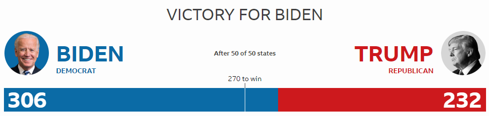

# us-elections-20
An analysis of the 2020 US Presidential election. Medium [article](https://tioans.medium.com/this-is-how-the-2020-us-election-results-look-like-ae04fc662f06).

  

## About 
The 59th quadrennial US presidential election was held on Tuesday, November 3, 2020. To win the election, the candidate needs as a minimum 270 out of 538 electoral votes. 

This project hopes to better explain the election results by use of official data, and aims to illustrate the answer to three questions, as defined below:

1. Which state had the absolute highest number of votes placed in the presidential election?
2. Which states were won by which candidate in the presidential election? 
3. What is the distribution of non-major party votes per state for the presidential election?

The dataset was obtained from Kaggle: https://www.kaggle.com/unanimad/us-election-2020

## Libraries

For this project, Numpy, Pandas and Plotly were used. Furthermore, it was developed as a Google Colab notebook.

## File breakdown 

* us_elections_20.ipynb
Jupyter Notebook with the analysis and code.
* archive.zip
The election dataset collected from Kaggle. Furthermore, an additional dataset with US state names and initials was added to the archive (also collected from Kaggle). 

## Summary

1. Based on the data, California is the state with the highest amount of votes by a comfortable 6 million lead.
2. The generated interactive map illustrates which states were won by which candidate; states with the color blue (all shades) were won by the Democratic Party candidate. States with the color red (all shades) were won by the Republican Party candidate. The darker the shade the bigger the lead for the corresponding party.
3. Although there are a number of non-major parties involved in the presidential election, the highest voted "third-party" in every state is the Libertarian Party, with the most votes taken in South Dakota (11095, 2.625 %), followed by North Dakota and Utah.

## Acknowledgments
Thanks to Raphael Fontes for gathering and publishsing the dataset to [Kaggle](https://www.kaggle.com/unanimad/us-election-2020). In addition, I'd like to thank Ashish Gupta for inspiring the visualization approach ([link](https://www.kaggle.com/roydatascience/us-election-results-2020)).
